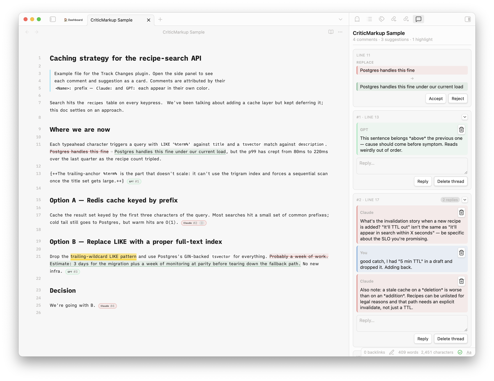

# Track Changes

Review [CriticMarkup](http://criticmarkup.com/) suggestions in an Obsidian side panel. Accept, reject, or reply.



## About
In my usecase, AI agents review and comment essays and texts. This plugin is only for reviewing applying/denying and commenting.
If you want to add CriticMarkup within obsidian yourself use [Fevol/obsidian-criticmarkup](https://github.com/Fevol/obsidian-criticmarkup) which is a full-featured general-purpose CriticMarkup plugin.

## Usage with AI
[`docs/SKILL.md`](docs/SKILL.md) is a starting-point reviewer prompt, adapt it to your own reviewing needs.
I use it to expiclity forbid the AI to write any kind of text. All text is human written. The AI just finds issues and errors and challanges the arguments.

## Features

- All five CriticMarkup forms: `{++add++}`, `{--del--}`, `{~~old~>new~~}`, `{>>comment<<}`, `{==highlight==}`
- Threaded comments — adjacent `{>>...<<}` blocks with no blank line between them group into one thread
- Multi-author support — each `<Name>:` prefix gets its own color; well-known AI names get brand-ish hues
- Accept / reject per suggestion; delete per message or per thread; reply inline
- **Finalize for publish** — resolves all remaining markup in one pass
- Reading mode renders either the accepted preview or raw side-by-side
- Markup inside code blocks is left alone

## Commands

| Command | What it does |
|---|---|
| Open review panel | Opens the side panel for the active note |
| Finalize for publish | Accepts all insertions, removes all deletions and comments |

## Install

**Community Plugins** → search "Track Changes" *(once accepted)*.

**Manual:** drop `main.js`, `manifest.json`, `styles.css` into `<vault>/.obsidian/plugins/track-changes/` and enable in settings.

## Build

```sh
npm install && npm run build
```

## License

MIT.
